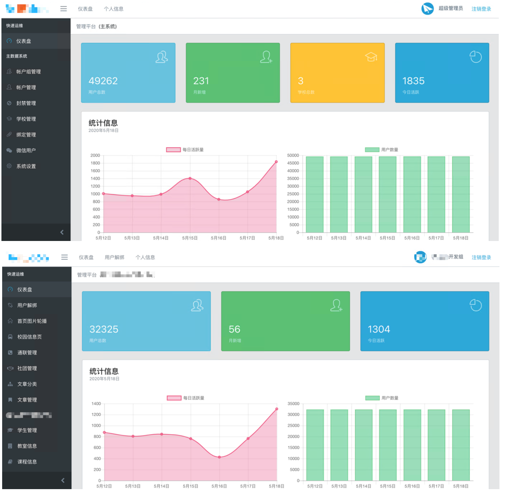

# iEdon Uniplex

## 🎉 简介

高校校园综合服务端(part of, 本源为主微服务)，``` Since 2017; End of life: 2020.12 ```

是 “WeYZU” 微信小程序服务端的指导模型。由于众所周知且不可抗力的原因，“WeYZU” 现已停止运营。

本源是 iEdon 对自己校园环境的实践。您不妨参考其他实现。

**本项目的实现旨在练习开发，学习交流，不要投入实际使用。后续衍生作品及利用本产品所作一切后果均与作者无关。**

**本源开发时间为 2019 年左右，故其中一些内容可能在现在不适用。**

## 💡 支持的系统

- 2008 URP(本科)
- 老版强智(本科)
- 新版正方(本科)
- 南软科技(研究生)
- 上述实现均整理自 Internet，仅供学习

## ✨ 特性

- 同时支持不同学院系统的实现
- 数据缓存系统(不用可自行剥离，并借助小程序前端本地缓存)
- 轻松扛过全校(含分院)合三万人(单机 J3160 软路由，5400rpm 笔记本机械盘)期末，亦可轻松在树莓派上运行
- 大量后台可设置的内容
- 基于自有微服务轮子的扩展性与服务框架
- 数据库可分布部署
- 多租户管理
- 一端同时支持微信与 QQ 小程序

## 🎀 主微服务端功能

需要搭配自有微服务轮子（当然只要去除中间件就可以无痛剥离）```iEdon Acorle``` 食用（SDK 付）。

- 成绩查询
- 课表查询
- 公告
- 日历
- 校车校历
- 新闻系统
- 课程搜索
- 挂科率 <需要微服务扩展>
- 主动推送 <需要微服务扩展>

## 🌸 交流

- 请利用代码中的联系方式

## 👀 效果

- 需要配合管理端使用，后续将上传

